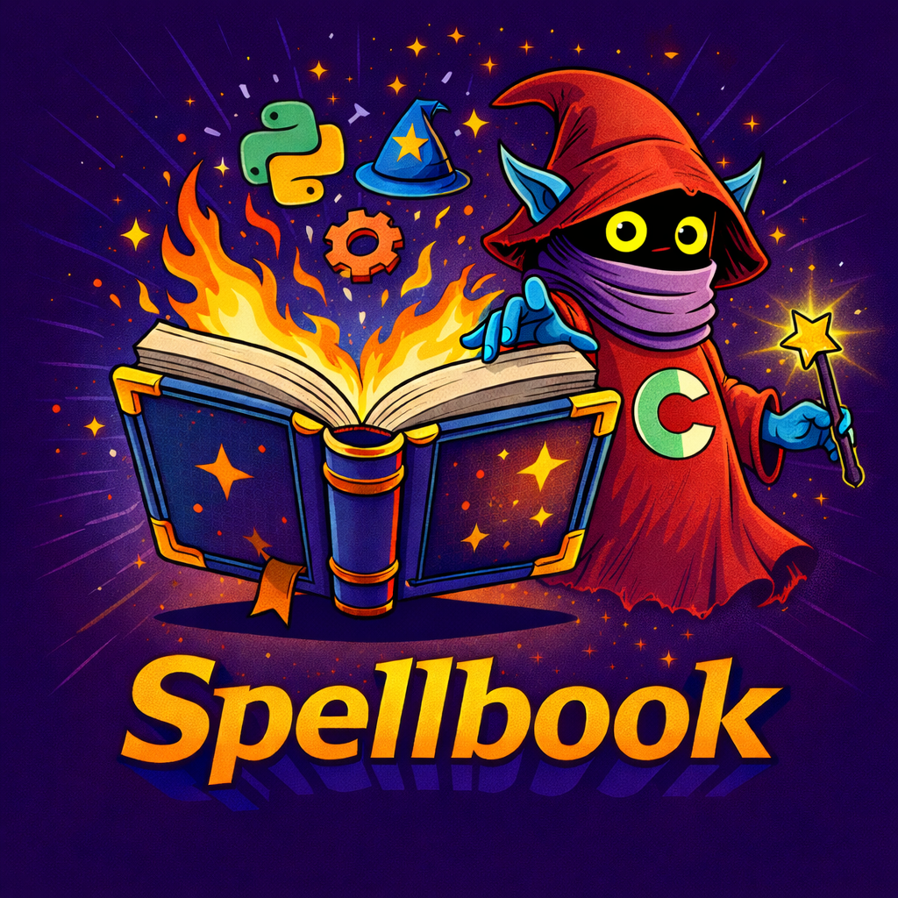

<p align="center">
  
</p>

# GoCortex Spellbook

A Python toolset for building, validating, and packaging Cortex Platform content packs.

## Overview

Spellbook is a development workbench for creating Cortex Platform content. It provides tools for pack creation, validation, and packaging while keeping your content in a separate repository that you control.

The key design principle is separation of concerns: Spellbook is the tool, your content is yours. You create a content instance with Spellbook, then push that instance to your own Git repository.

## Features

- Instance initialisation with optional GitHub Actions templates
- Multi-pack support within a single content instance
- Content renaming to fix naming mismatches after copying packs
- Validation and linting using demisto-sdk
- Automated packaging into distributable zip files
- Direct upload to Cortex Platform instances

## Workflow Guides

Choose your preferred method and follow the corresponding guide:

| Method | Best For | Guide |
|--------|----------|-------|
| Docker (Local) | Most users. No Python setup required. | [README_LOCAL-DOCKER.md](DOCS/README_LOCAL-DOCKER.md) |
| Source (Local) | Developers who want to modify Spellbook. | [README_SOURCE.md](DOCS/README_SOURCE.md) |
| CI/CD | Automated builds triggered by Git tags. | [README_CICD.md](DOCS/README_CICD.md) |

## Quick Start (Docker)

```bash
# Pull from GitHub Container Registry (preferred)
docker pull ghcr.io/gocortex/spellbook:latest

# Or build locally from source
docker build -t ghcr.io/gocortex/spellbook .

# Create a content instance
docker run --rm -v $(pwd):/content ghcr.io/gocortex/spellbook init my-content --author "My Organisation"

# Initialise Git (required for validation)
cd my-content
git init
git add .
git commit -s -m "Initial commit"

# Build all packs
docker run --rm -v $(pwd):/content ghcr.io/gocortex/spellbook build --all
```

## Commands

| Command | Description |
|---------|-------------|
| init | Create a new content instance with starter pack |
| create | Create a new pack from template |
| rename-content | Rename content items to match pack name |
| list-packs | List all discovered packs |
| validate | Validate a pack using demisto-sdk |
| validate-all | Validate all packs |
| lint | Lint a pack using demisto-sdk pre-commit |
| build | Build and package packs |
| upload | Upload a pack to Cortex Platform |
| version | Show version information for a pack |
| set-version | Set a specific version for a pack |
| bump-version | Automatically increment pack version |

## Instance Structure

After running `init`, your instance has this structure:

```
my-content/
|-- .github/workflows/      # CI/CD pipelines (if enabled)
|   |-- build.yml           # Builds packs on version tags
|   +-- validate.yml        # Validates packs on PRs
|-- Packs/
|   +-- SamplePack/         # Starter pack with examples
|       |-- pack_metadata.json
|       |-- README.md
|       |-- CorrelationRules/
|       |-- ParsingRules/
|       +-- ModelingRules/
|-- artifacts/              # Built zip files (gitignored)
+-- spellbook.yaml          # Build configuration
```

## Configuration

Each instance has a `spellbook.yaml` file:

```yaml
packs_directory: Packs
artifacts_directory: artifacts

defaults:
  support: community
  author: "Your Organisation"
  marketplaces:
    - xsoar
    - marketplacev2

exclude_packs: []

validation:
  enabled: true
  allow_warnings: true

packaging:
  create_zip: true
```

## Version Management

Pack versions are stored in `pack_metadata.json` within each pack. Use these commands to manage versions:

```bash
# Show current version
gocortex-spellbook version SamplePack

# Set a specific version
gocortex-spellbook set-version SamplePack 2.0.0

# Increment revision (1.0.0 -> 1.0.1) - default behaviour
gocortex-spellbook bump-version SamplePack

# Increment revision explicitly (1.0.0 -> 1.0.1)
gocortex-spellbook bump-version SamplePack --revision

# Increment minor version (1.0.0 -> 1.1.0)
gocortex-spellbook bump-version SamplePack --minor

# Increment major version (1.0.0 -> 2.0.0)
gocortex-spellbook bump-version SamplePack --major
```

Git tags (format: `PackName-v1.0.0`) can be used to trigger CI/CD builds but are not required for local development.

## Known Issues

See [DOCS_PRIVATE/KNOWN_BUGS.md](DOCS_PRIVATE/KNOWN_BUGS.md) for documented issues and workarounds.

## Licence

This project is available under the MIT Licence.

## References

- Cortex Platform Content Pack Format: https://xsoar.pan.dev/docs/packs/packs-format
- Demisto SDK Documentation: https://docs-cortex.paloaltonetworks.com/r/1/Demisto-SDK-Guide
