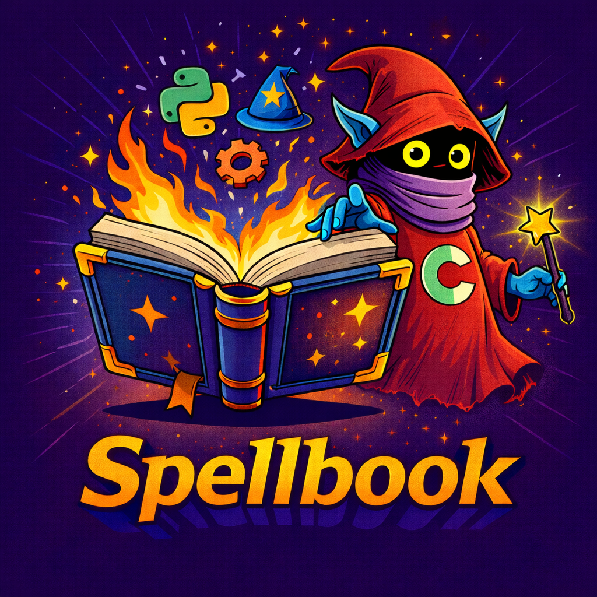

<p align="center">
  
</p>

# GoCortex Spellbook

A Python toolset for building, validating, and packaging Cortex Platform content packs.

## Overview

GoCortex Spellbook is a toolset for building, validating, and packaging Cortex Platform content packs. It solves the problem of creating compliant content packs without needing to understand the intricacies of the demisto-sdk and Cortex Platform schema requirements.

What it does:

- Creates new content pack instances with correct structure
- Generates XSIAM content templates (CorrelationRules, ParsingRules, ModelingRules)
- Validates content against Cortex Platform schemas using demisto-sdk
- Packages content into uploadable zip files
- Uploads content directly to Cortex Platform instances

Why it exists:

The demisto-sdk has many features and validation rules. Spellbook wraps it in a simpler interface and provides working templates that have been verified to upload successfully.

## Features

- Instance initialisation with optional GitHub Actions templates
- Multi-pack support within a single content instance
- Import of tenant-authored content via `summon correlation`, `summon datamodel`
  and `summon parsing`
- Token-based template generation via `summon template` (e.g. `intel_retrohunt`, `parsing_modeling`)
- Validation using demisto-sdk, plus ruff linting and unit-test execution for Python content, matching the official demisto/content store setup
- Automated packaging into distributable zip files
- Direct upload to Cortex Platform instances

## Workflow Guides

Choose your preferred method and follow the corresponding guide:

| Method | Best For | Guide |
|--------|----------|-------|
| Docker (Local) | Most users. No Python setup required. | [README_LOCAL-DOCKER.md](README_LOCAL-DOCKER.md) |
| Source (Local) | Developers who want to modify Spellbook. | [README_SOURCE.md](README_SOURCE.md) |
| CI/CD | Automated builds triggered by Git tags. | [README_CICD.md](README_CICD.md) |

## Quick Start (Docker)

```bash
# Pull from GitHub Container Registry (preferred)
docker pull ghcr.io/gocortexio/spellbook:latest

# Or build locally from source
docker build -t gocortex-spellbook .

# Create a content instance
docker run --rm \
  -v $(pwd):/content \
  -v ~/.gitconfig:/home/spellbook/.gitconfig:ro \
  ghcr.io/gocortexio/spellbook init my-content --author "My Organisation"

# Initialise Git (required for validation)
cd my-content
git init
git add .
git commit -s -m "Initial commit"

# Build all packs
docker run --rm \
  -v $(pwd):/content \
  -v ~/.gitconfig:/home/spellbook/.gitconfig:ro \
  ghcr.io/gocortexio/spellbook build --all
```

If no packs are discovered, `build --all` and `validate-all` exit with a
grepable `[ERROR]` rather than reporting success, so a missing volume mount in
CI cannot produce a green pipeline and an empty release. SamplePack is excluded
from discovery; build it directly by name.

## Commands

| Command | Description |
|---------|-------------|
| init | Create a new content instance with starter pack |
| check-init | Check the initialised instance environment |
| list-instances | List all content instances |
| create | Create a new pack from template |
| list-packs | List all discovered packs |
| validate | Validate a pack using demisto-sdk |
| validate-all | Validate all packs |
| format | Format a pack's Python for the content pipeline |
| build | Build and package packs |
| upload | Upload a pack to Cortex Platform |
| version | Show version information for a pack |
| set-version | Set a specific version for a pack |
| bump-version | Automatically increment pack version |
| summon correlation | Import correlation rules from platform JSON export |
| summon datamodel | Import a data model rule from XIF text |
| summon parsing | Import a parsing rule from XIF text |
| summon template | Generate content from templates with token substitution |
| rename-content | Rename content items to match pack name (temporarily disabled) |

## Creating and Importing Content

Create a new pack. By default `create` scaffolds a placeholder `Author_image.png`
(the GoCortexIO wordmark) at the pack root; use `--author` to set the pack
author, or `--no-author-image` to skip the image:

```bash
docker run --rm -v $(pwd):/content \
  ghcr.io/gocortexio/spellbook create MyPack --author "My Organisation"

# skip the placeholder author image
docker run --rm -v $(pwd):/content \
  ghcr.io/gocortexio/spellbook create MyPack --no-author-image
```

Import content authored in a Cortex Platform tenant. Every importer reads from
stdin, so pipe a file in or paste and press Ctrl+D:

```bash
# correlation rules from a JSON export
cat rules.json | docker run -i --rm -v $(pwd):/content \
  ghcr.io/gocortexio/spellbook summon correlation MyPack

# a data model (XDM) rule from XIF (must start with [MODEL: dataset="..."])
cat rule.xif | docker run -i --rm -v $(pwd):/content \
  ghcr.io/gocortexio/spellbook summon datamodel MyPack

# a parsing rule from XIF (must start with [INGEST: ...])
cat rule.xif | docker run -i --rm -v $(pwd):/content \
  ghcr.io/gocortexio/spellbook summon parsing MyPack
```

`summon datamodel` writes the three-file modelling rule package (`.yml`, `.xif`,
`_schema.json`) into `ModelingRules/`, named after the dataset. Use `--name` to
override the name or `--minimal-schema` to emit only `_raw_log` instead of
inferring columns.

`summon parsing` writes the two-file parsing rule package (`.yml`, `.xif`) into
`ParsingRules/`, named after the target dataset. Use `--name` to override it.

Both rule types are file sets whose stems must agree, because demisto-sdk
enumerates the `.yml` and finds the rest by stem. Creating them by hand is the
one way to get this wrong: a lone `.xif` is invisible, so the pack validates,
uploads and installs while the rule never deploys. `validate` now fails on an
incomplete set.

## Pack Attribution

Every pack must carry `CONTRIBUTORS.json` at its root, and `validate` fails
without it. `create` writes one seeded with the pack author, so a new pack
passes from the start.

The format is demisto-sdk's: a flat JSON array of names, nothing else.

```json
[
    "Simon Sigre"
]
```

Upgrading an existing pack is one line per pack:

```bash
echo '["Your Name"]' > Packs/MyPack/CONTRIBUTORS.json
```

## Formatting Python

When `validate` reports that Python content is not formatted, run:

```bash
docker run --rm -v $(pwd):/content \
  ghcr.io/gocortexio/spellbook format MyPack
```

Do not run plain `ruff format` instead. It uses ruff's own default line length
of 88 where the content pipeline uses 130, so it splits lines `validate` had
already accepted and leaves the pack further from passing. `spellbook format`
applies the same configuration `validate` checks against. It is the only
command that edits your pack, it runs only when you type it, and it applies
the formatter alone -- lint findings are left for you to judge.

## Templates and Triggers

`summon template intel_retrohunt` renders a playbook, and ships no Trigger.
That is deliberate rather than an oversight, and it means the playbook will
not start on its own.

A Trigger is the only content-level thing that binds an issue to a playbook,
and its `alerts_filter` names which alerts should start it. That is a
detection-design decision the template has no way to know, so it is authored
by hand once you know which correlation rules the playbook should respond to.
The reference shape, including the hex `trigger_id` and the rule that
`playbook_id` must equal the playbook's `id` byte for byte, is in
`PRIVATE_DOCS/XSIAM_CONTENT_GUIDELINES.md` under Triggers.

`validate` will not let you ship one carrying the old `PLAYBOOK_ID_HERE`
placeholder, but it cannot tell you that a playbook has no Trigger at all,
because a sub-playbook started by its parent is correct without one.

## Instance Structure

After running `init`, your instance has this structure:

```
my-content/
|-- .github/workflows/      # CI/CD pipelines (if enabled)
|   |-- conjure.yml          # Builds packs on version tags
|   +-- validate.yml        # Validates packs on PRs
|-- Packs/
|   +-- SamplePack/         # Starter pack with examples
|       |-- pack_metadata.json
|       |-- README.md
|       |-- Author_image.png # Author branding (auto-detected by demisto-sdk)
|       |-- CorrelationRules/
|       |-- ParsingRules/
|       +-- ModelingRules/
|-- artifacts/              # Built zip files (gitignored)
|-- templates/              # Built-in templates copied during init (used by `summon template`)
+-- spellbook.yaml          # Build configuration
```

## Configuration

Each instance has a `spellbook.yaml` file:

```yaml
packs_directory: Packs
artifacts_directory: artifacts

defaults:
  support: community
  author: "Your Organisation"
  marketplaces:
    - xsoar
    - marketplacev2
    - platform

exclude_packs: []

validation:
  enabled: true
  allow_warnings: true

packaging:
  create_zip: true
```

## Version Management

Pack versions are stored in `pack_metadata.json` within each pack. Use these commands to manage versions:

```bash
# Show current version
python spellbook.py version SamplePack

# Set a specific version
python spellbook.py set-version SamplePack 2.0.0

# Set version and create Git tag (stages all pack files)
python spellbook.py set-version SamplePack 2.0.0 --tag

# Increment revision (1.0.0 -> 1.0.1) - default behaviour
python spellbook.py bump-version SamplePack

# Increment revision explicitly (1.0.0 -> 1.0.1)
python spellbook.py bump-version SamplePack --revision

# Increment minor version (1.0.0 -> 1.1.0)
python spellbook.py bump-version SamplePack --minor

# Increment major version (1.0.0 -> 2.0.0)
python spellbook.py bump-version SamplePack --major

# Bump version and create Git tag for CI/CD
python spellbook.py bump-version SamplePack --tag

# Bump with custom commit message (for auto-closing issues)
python spellbook.py bump-version SamplePack --tag -m "Closes #123"
```

The `--tag` flag stages all files in the pack directory, commits them, and creates a Git tag in the format `PackName-v1.0.1`. Use `--message` or `-m` to specify a custom commit message for CI/CD integration. Push with `git push && git push origin PackName-v1.0.1` to trigger CI/CD builds.

## Licence

This project is licensed under the GNU Affero General Public License v3.0 or later (AGPL-3.0-or-later). See the [LICENSE](LICENSE) file for the full licence text.

## References

- Cortex Platform Content Pack Format: https://xsoar.pan.dev/docs/packs/packs-format
- Demisto SDK Documentation: https://docs-cortex.paloaltonetworks.com/r/1/Demisto-SDK-Guide
